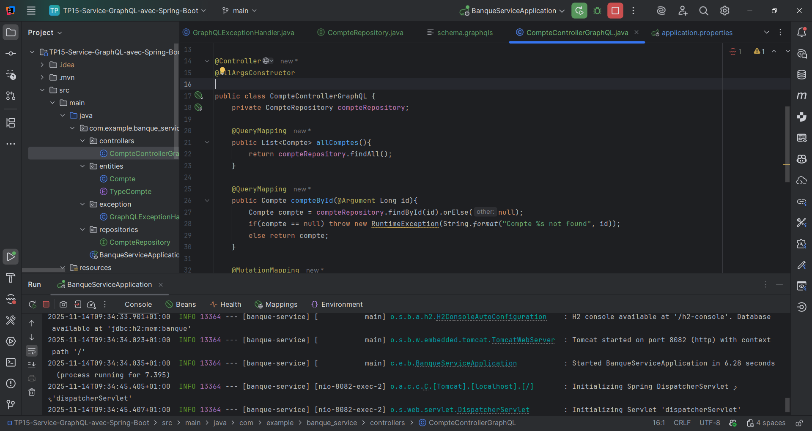
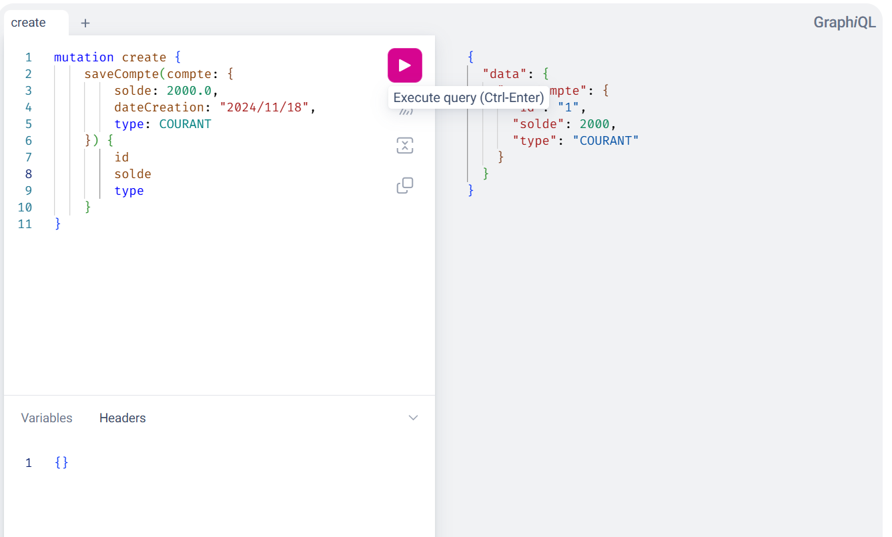
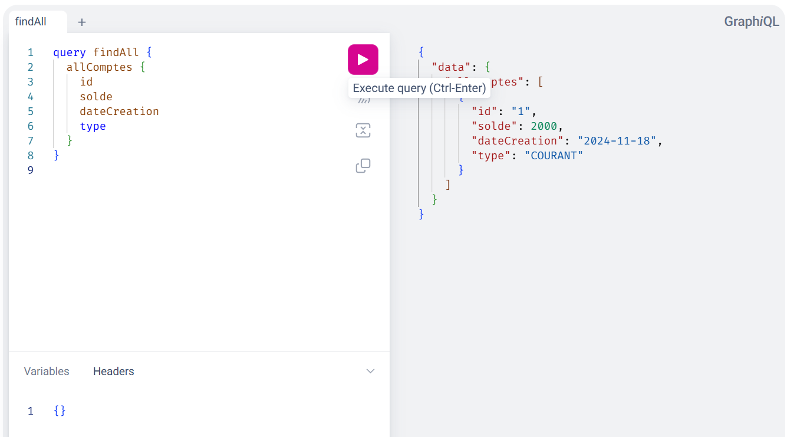
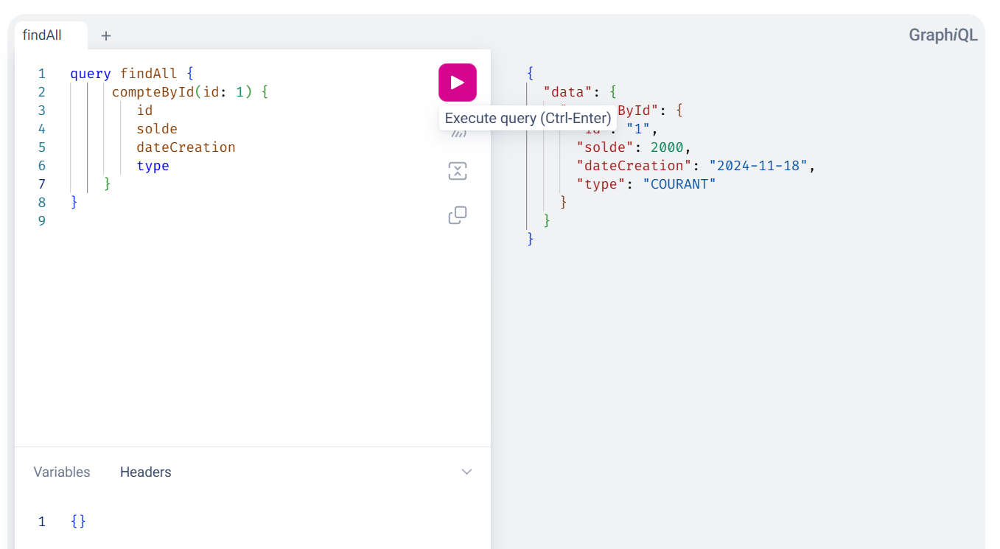
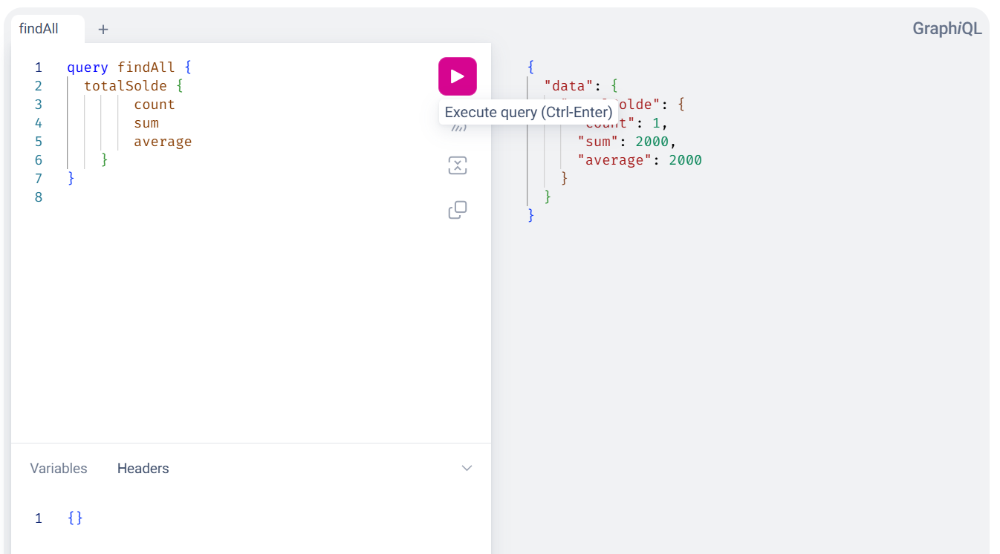
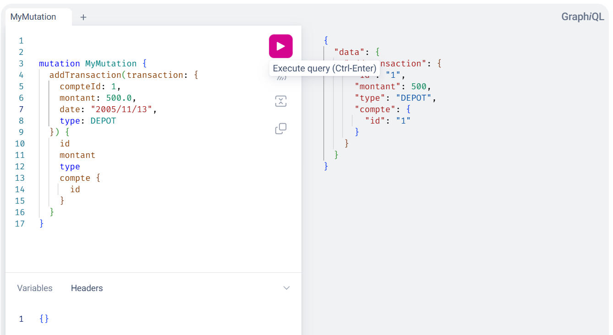
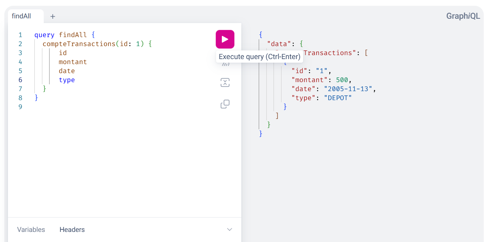
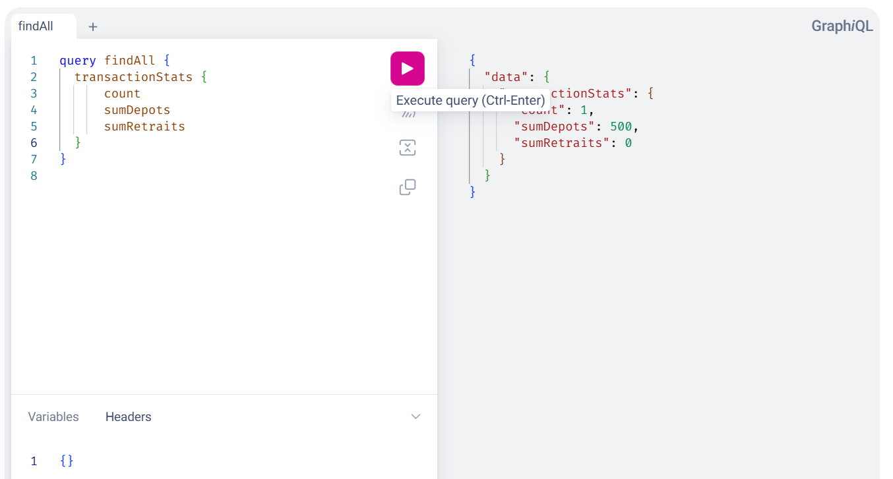

# TP 15 — Service GraphQL avec Spring Boot

Ce dépôt contient un microservice de gestion de comptes bancaires exposant une API GraphQL (queries, mutations, agrégations et gestion d’erreurs) avec Spring Boot.

## 1) Création du projet Spring Boot
- Initialisation via Spring Initializr (Spring Boot, Web, Spring Data JPA, H2, GraphQL Spring Boot Starter).
- Package racine: `com.example.banque_service`.

Capture IDE (application démarrée) :



## 2) Configuration des propriétés de l'application
- Base H2 en mémoire, console H2 activée.
- Port HTTP: 8082.
- Activation de GraphiQL pour tester les requêtes.

Fichier: `src/main/resources/application.properties`.

## 3) Définition des entités
- `Compte` (id, solde, dateCreation, type) — `TypeCompte` (COURANT, EPARGNE).
- `Transaction` (id, montant, date, type, relation vers Compte) — `TypeTransaction` (DEPOT, RETRAIT).

## 4) Définition du schéma GraphQL
Fichier: `src/main/resources/graphql/schema.graphqls`.
- Queries exposées: `allComptes`, `compteById(id)`, `totalSolde`, `compteTransactions(id)`, `transactionStats`.
- Mutations exposées: `saveCompte(compte)`, `addTransaction(transaction)`.

## 5) Création du contrôleur GraphQL
- Contrôleur: `CompteControllerGraphQL` utilisant `@QueryMapping` et `@MutationMapping`.
- Requêtes déléguées aux `Repository` Spring Data JPA.

## 6) Gestion des exceptions GraphQL
- `GraphQLExceptionHandler` convertit les erreurs métier en erreurs GraphQL claires (messages lisibles côté client GraphiQL).

## 7) Tests avec GraphiQL
Ouvrir l’interface: `http://localhost:8082/graphiql`

### a) Création d’un compte (mutation)
```
mutation create {
  saveCompte(compte: {
    solde: 2000,
    dateCreation: "2024/11/18",
    type: COURANT
  }) {
    id
    solde
    type
  }
}
```

Résultat (capture):



### b) Lister tous les comptes
```
query findAll {
  allComptes {
    id
    solde
    dateCreation
    type
  }
}
```



### c) Récupérer un compte par ID
```
query findOne {
  compteById(id: 1) {
    id
    solde
    dateCreation
    type
  }
}
```



### d) Agrégations sur les soldes
```
query findAll {
  totalSolde {
    count
    sum
    average
  }
}
```



### e) Ajouter une transaction (mutation)
```
mutation MyMutation {
  addTransaction(transaction: {
    compteId: 1,
    montant: 500,
    date: "2005/11/13",
    type: DEPOT
  }) {
    id
    montant
    type
    compte { id }
  }
}
```



### f) Lister les transactions d’un compte
```
query findAll {
  compteTransactions(id: 1) {
    id
    montant
    date
    type
  }
}
```



### g) Statistiques sur les transactions
```
query findAll {
  transactionStats {
    count
    sumDepots
    sumRetraits
  }
}
```



## 8) Ajout de la gestion des transactions
- Les mutations mettent à jour les soldes selon le type de transaction (dépôt/retrait) avec gestion transactionnelle Spring.
- Les statistiques agrègent les montants par type.
